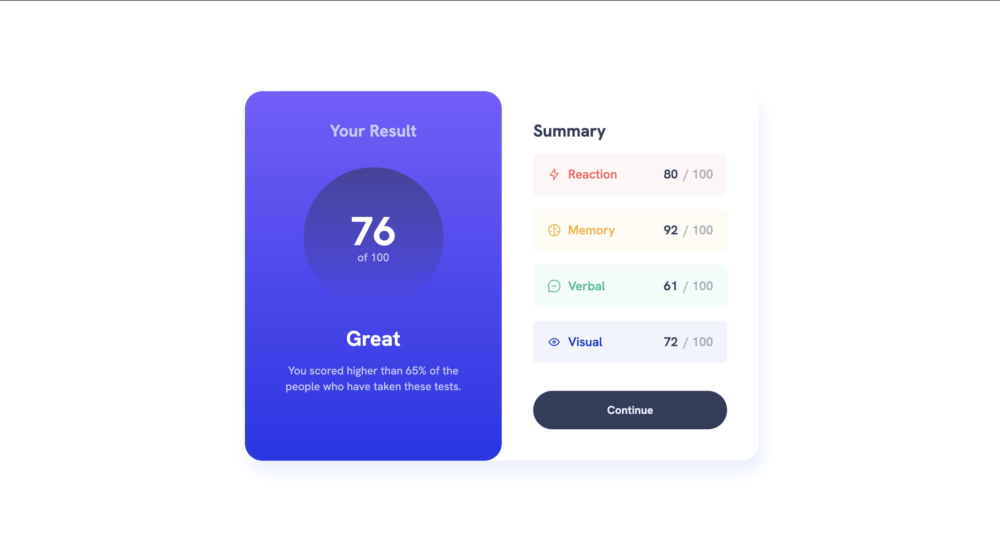

# Frontend Mentor - Results summary component solution

This is a solution to the [Results summary component challenge on Frontend Mentor](https://www.frontendmentor.io/challenges/results-summary-component-CE_K6s0maV). Frontend Mentor challenges help you improve your coding skills by building realistic projects.

## Table of contents

- [Overview](#overview)
    - [The challenge](#the-challenge)
    - [Screenshot](#screenshot)
    - [Links](#links)
- [My process](#my-process)
    - [Built with](#built-with)
    - [Continued development](#continued-development)
    - [Useful resources](#useful-resources)
- [Author](#author)
- [Acknowledgments](#acknowledgments)

## Overview

### The challenge

Users should be able to:

- View the optimal layout for the interface depending on their device's screen size
- See hover and focus states for all interactive elements on the page
- **Bonus**: Use the local JSON data to dynamically populate the content

### Screenshot

### Links

- Solution URL: https://github.com/amjadsh97/results-summary-component
- Live Site URL: https://results-summary-component-ivory.vercel.app/

## My process

### Built with

- Semantic HTML5 markup
- CSS custom properties
- Flexbox
- Vite.
- Typescript

### Continued development

In the future, I will prioritize further developing my skills in making the user experience
more seamless and intuitive by focusing on responsive design principles. I aim to delve
deeper into backend development, especially database management and user authentication,
to enhance the functionality and security of the applications I build. Continuous learning and experimentation with new technologies will be crucial for
staying updated with industry trends and delivering cutting-edge solutions.

### Useful resources

- [React Docs](https://react.dev/) - This helped me for building react components. I really liked using this docs.

## Author

- Website - [Amjad Shadid](https://amjadshadid.com)
- Frontend Mentor - [@amjadsh97](https://www.frontendmentor.io/profile/amjadsh97)
- Twitter - [@Amjadshadid](https://twitter.com/Amjadshadid)
- Linkedin - [@Amjad Shadid](https://www.linkedin.com/in/amjad-shadid-134355134/)